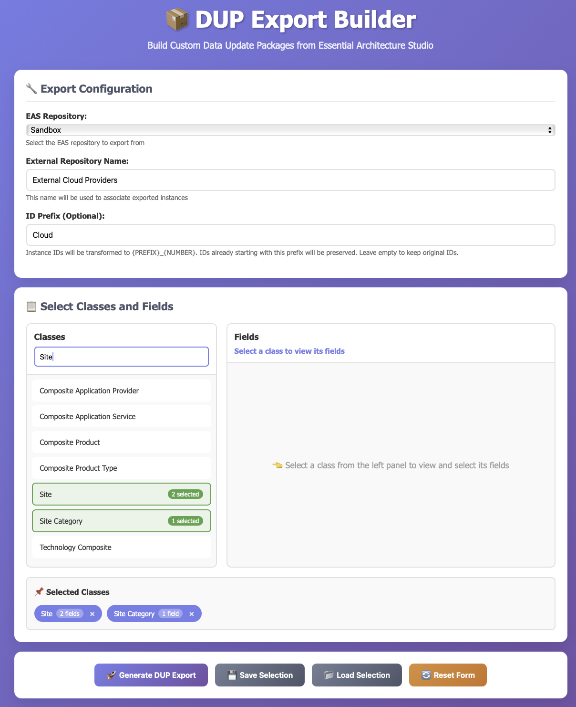

# Essential DUP Exporter

A Spring Boot application for exporting data from Essential Architecture Studio (EAS) repositories as DUP (Data Update Package) files for migration of specific class instances between EAS instances.

## Overview

Essential DUP Exporter provides a web-based interface to:
- Connect to Essential Architecture Studio Cloud repositories
- Select specific classes and fields to export
- Transform instance IDs with custom prefixes
- Generate .dup files containing Jython scripts for data import


The application streamlines the process of migrating select data between EAS Cloud repositories by packaging selected data into importable DUP files.



## Features

- **Selective Export**: Choose specific EAS classes and their fields to include in the export
- **Multiple Repository Support**: Configure and switch between multiple EAS repositories
- **ID Transformation**: Apply custom ID prefixes to prevent conflicts during import
  - Preserves existing prefixed IDs
  - Intelligently assigns new sequential IDs for unprefixed instances
- **Smart Reference Handling**: Automatically transforms IDs in related objects and lists
- **Web UI**: User-friendly interface for building exports

## Technology Stack

- **Java 25**
- **Spring Boot 4.0**
- **Maven**
- **Lombok**
- **Thymeleaf** (for web UI)

## Prerequisites

- Java 25 or higher
- Maven 3.9+
- Access to an Essential Architecture Studio Cloud instance with API credentials

## Quick Start

### 1. Clone and Build

```bash
git clone <repository-url>
cd essentials-dup-export
mvn clean install
```

### 2. Configure

Edit `src/main/resources/application.yml`:

```yaml
eas:
  endpoint: https://your-essential-instance.essentialintelligence.com/api
  username: your-api-username@yourdomain.com
  password: your-api-password
  apiKey: your-api-key
  repositories:
    - name: "Production"
      repoId: "prod-repo-id"
    - name: "Development"
      repoId: "dev-repo-id"
```

### 3. Run

```bash
# Run with default profile
mvn spring-boot:run

# Or run with specific profile
mvn spring-boot:run -Dspring-boot.run.profiles=prod
```

### 4. Access

Open your browser to: `http://localhost:8080`

## Project Structure

```
src/
├── main/
│   ├── java/com/qtzar/essentialsexport/
│   │   ├── clients/          # EAS API client
│   │   ├── configuration/    # Spring configuration
│   │   ├── controllers/      # REST endpoints
│   │   ├── model/            # Data models
│   │   └── services/         # Business logic
│   └── resources/
│       ├── dupsupport/       # DUP package templates
│       ├── static/           # Web UI assets
│       └── application.yml   # Configuration
└── test/                     # Comprehensive test suite
```

## License

Copyright 2025 Declan Lynch

Permission is hereby granted, free of charge, to any person obtaining a copy of this software and associated
documentation files (the “Software”), to deal in the Software without restriction, including without limitation the 
rights to use, copy, modify, merge, publish, distribute, sublicense, and/or sell copies of the Software, and to permit 
persons to whom the Software is furnished to do so, subject to the following conditions:

The above copyright notice and this permission notice shall be included in all copies or substantial portions of the
Software.

THE SOFTWARE IS PROVIDED “AS IS”, WITHOUT WARRANTY OF ANY KIND, EXPRESS OR IMPLIED, INCLUDING BUT NOT LIMITED TO THE 
WARRANTIES OF MERCHANTABILITY, FITNESS FOR A PARTICULAR PURPOSE AND NONINFRINGEMENT. IN NO EVENT SHALL THE AUTHORS OR 
COPYRIGHT HOLDERS BE LIABLE FOR ANY CLAIM, DAMAGES OR OTHER LIABILITY, WHETHER IN AN ACTION OF CONTRACT, TORT OR 
OTHERWISE, ARISING FROM, OUT OF OR IN CONNECTION WITH THE SOFTWARE OR THE USE OR OTHER DEALINGS IN THE SOFTWARE.

## Support

For issues or questions, please create an issue in the repository.
